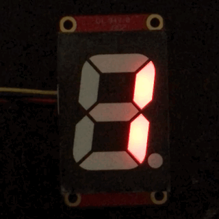
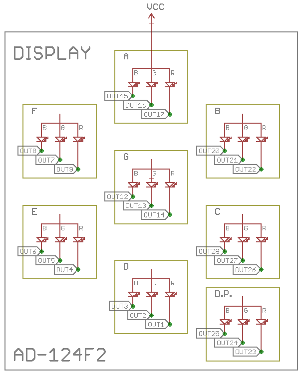

# Python module for the Clueboard RGB7Segment display.



This module provide support for using the RGB7Segment QWIIC display from Clueboard on your Raspberry Pi.

## Usage

    $ pip3 install rgb7seg
    $ python3 
    >>> from rgb7seg import NumberDisplay
    >>> myNumeral = NumberDisplay()
    >>> myNumeral.display(8, myNumeral.colors['red'])

# Contributions

Contributions are welcome! Please file a PR or Issue if you have a feature to add or request, or a bug to fix or report.

# Documentation

There are 3 different abstractions you can work with, depending on what you want to do. Most people will want to use the `NumberDisplay()` abstraction.

## `NumberDisplay()`

This class handles displaying characters for you. Number in the name is a little misleading as it will also display the English charecters A-Z, albeit in a somewhat limited form. You can display your character in any color you like but you may not color the segments differently.

### Example

```py
# Count from 0 to 9 in purple
color = myNumeral.colors['purple']

for i in range(10):
    myNumeral.display(i, color)
    sleep(1)

myNumeral.display()
```

### `NumberDisplay()` Arguments

In most cases you can simply instaniate `NumberDisplay()` without any arguments. If you have more than one numeral connected, or have changed the default address of your numeral, you will need to pass in the address of your numeral.

**i2c_bus**

If you have an older Raspberry Pi your i2c bus is bus 0, and you need to pass it here. If you have a newer Raspberry Pi you do not need to pass anything here.

**ic_address**

This is the i2c address of your numeral. There are only 4 addresses possible:

* 0x3F (11, default)
* 0x3E (10)
* 0x3D (01)
* 0x3C (00)

**colors**

This is a dictionary mapping color names to HSV values. 

Dictionary Format:

    colors = {
        # name      hue         sat  val
        'white':   (0,          0,   1),
        'black':   (0,          0,   0)
    }

### `NumberDisplay()` Functions

#### `set_color(color)`

Sets the color used for the next character. Will be overwritten if color is passed to `display()`.

#### `display(character='', color=None)`

Display a character on your numeral. You can display all the numerals 0-9 and the english letters A-Z.


## `HSV7Segment()`

This class handles the details of displaying RGB colors on each segment. Using this class you can control the color of each individual segment on your numeral. Refer to the image below to see the label for each segment.

This class is used by `NumberDisplay()` and is responsible for applying gamma corrections.



### Example

```py
from time import sleep
myNumeral = HSV7Segment()
myNumeral.a = [1, 1, 1]
sleep(1)
myNumeral.a = [0, 0, 0]
```

## `IS31FL3731A()`

This is the low-level interface to the IS31FL3731A powering your numeral. Using this interface you can access the underlying LEDs directly without any interference.

### Example

```py
from time import sleep

display = is31fl3235a()

# Blink the led connected to OUT1
while True:
    display[1] = 128
    sleep(1)
    display[1] = 0
    sleep(1)
```
